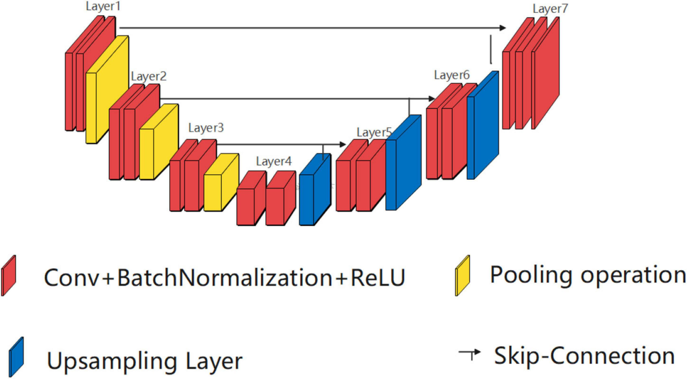
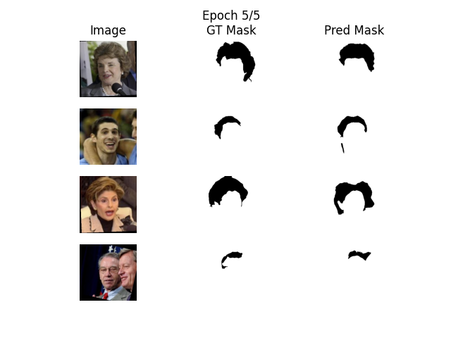
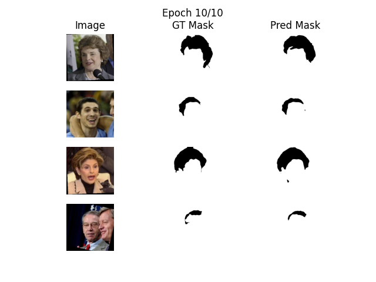
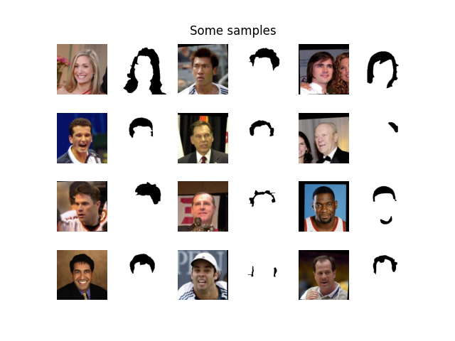

# Hair Color Changer

## A brief overview

Built an U-NET segmentation model to learn to extract the hair of a photo of a person. Also, exported the binaries of the model and used them in a demo, using `gradio`, to extract the hair, color it yellow, then place it into the result image. To tune the hyperparameters, `wandb` was used, each can do this as well by providing a wandb API key like in the [Environment](#environment) section.

## Model architecture



## Some validation results



## Usage

To train the segmentation model, you firstly need to install one of the datasets:
- [Labeled Faces in the Wild](https://vis-www.cs.umass.edu/lfw), from there you need to download 
   the [original images](http://vis-www.cs.umass.edu/lfw/lfw-funneled.tgz) (and add them to a directory named `images` in the dataset directory)
   the [masks](https://vis-www.cs.umass.edu/lfw/part_labels/parts_lfw_funneled_gt_images.tgz) (and add them to a directory named `masks` in the dataset directory), the [training parts](https://vis-www.cs.umass.edu/lfw/part_labels/parts_train.txt),
   [testing parts](https://vis-www.cs.umass.edu/lfw/part_labels/parts_test.txt) and the
   [validation parts](https://vis-www.cs.umass.edu/lfw/part_labels/parts_validation.txt) (add all the parts files in the dataset directory).

After that, adjust the `config.yaml` configuration file, then you can train a model using the command:
```bash
$ python segmentation/train.py
```

## LFW Dataset Samples



## Setup

1. Be sure you have `Python 3.11` installed.
2. Create a virtual environment, using the command:
   ```bash
   $ python -m venv venv
   ```
   Then, activate the virtual environment based on your Operating System.
3. Upgrade the python packet manager to 23.3.1, using the command:
   ```bash
   $ pip install --upgrade pip==23.3.1
   ```
4. Before installing the required requirements, change the hardware specific libraries (like torch / torchvision using cuda 12.1). Install the requirements libraries, using the command:
   ```bash
   $ pip install -r requirements.txt
   ```

## Environment

If you want to train the model locally, you should create a `.env` file in the root directory with the following entries:
```bash
WANDB_API_KEY=<your wandb api key>
```
Most of the other environmental variables are located in `config.yaml` and in `segmentation/train.py` (where `sweep_config` is located for wandb hyperparameters fine-tuning).