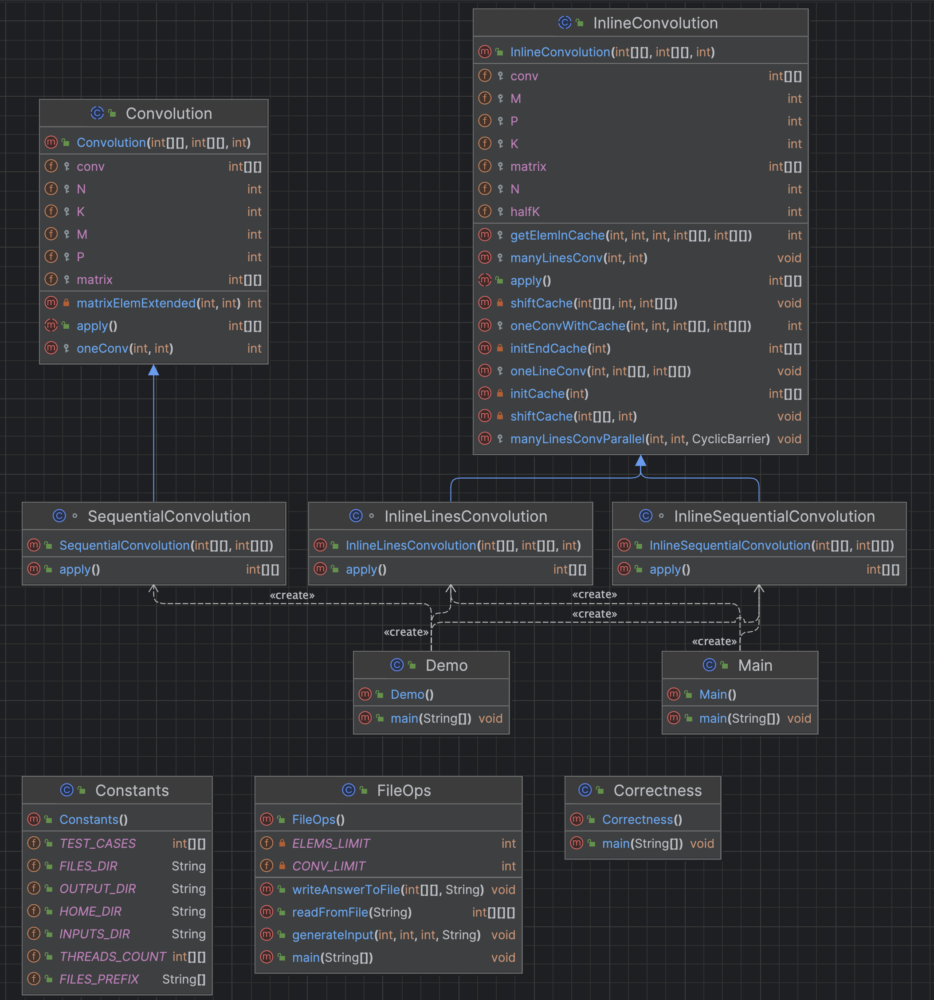

# Homework 2 - Inline Convolution

## Approaches

### Sequential

For the sequential approach, for each operation, if we do the operations line by line, we need to retain a copy of the previous (K - 1) / 2 lines and one of the current line, so (K + 1) \* M / 2 extra memory, because when applying the convolution operation on a element and imediatly modify it, we will lose the old value (needed to perform the convolution operation).

For the borders, we clipped the value to the closest one in the matrix (like in the previous approach, so a virtual padding with the closest neighbour for each value).

### Lines

For the lines parallel approach, each thread's job would be to complete [N / P] lines, and the first N % P lines will be distributed equally to the first threads.

Similarly to the sequential approach, we need extra memory space, because the old values in the matrix will be lost after applying the convolution operation, but this time, for each thread we will need to retain the first (K + 1) / 2 lines (the last one being the line we are doing the convolution operation on), but we will need to retain the next (K - 1) / 2 lines after the last line the thread is working on, because those will be also modified by the next thread, so we will need K \* M memory for each thead, so K \* M \* P extra memory.

Because the moment the threads get the resources from the operating system to do their job cannot be controlled and some threads could be faster (so a thread will finish its job and will modify the first lines before the previous thread would copy them), we need to put a barrier (that waits for all the threads to arrive there to unlock it) after the copying process to be sure that all the threads get the resources they are needing.

## Class architecture

## Results

### C++ Results

| Test | Result in ms |
| :--- | -----------: |
| **_n = m = 10, k = 3_**
| **sequential** | 0.0075626 |
| lines with 2 threads | 0.0413086 |
| **_n = m = 1000, k = 3_**
| sequential | 54.4617 |
| lines with 2 threads | 28.0424 |
| lines with 4 threads | 14.3585 |
| **lines with 8 threads** | 7.82501 |
| lines with 16 threads | 7.8262 |
| **_n = m = 10000, k = 3_**
| sequential | 5461.97 |
| lines with 2 threads | 2771.4 |
| lines with 4 threads | 1423.06 |
| lines with 8 threads | 717.721 |
| **lines with 16 threads** | 624.656 |

### Java Results

| Test | Result in ms |
| :--- | -----------: |
| **_n = m = 10, k = 3_**
| **sequential** | 0.0898793 |
| lines with 2 threads | 1.46338 |
| **_n = m = 1000, k = 3_**
| sequential | 33.2194 |
| **lines with 2 threads** | 30.507 |
| lines with 4 threads | 42.802 |
| lines with 8 threads | 65.4224 |
| lines with 16 thraeds | 100.067 |
| **_n = m = 10000, k = 3_**
| sequential | 1123.74 |
| lines with 2 threads | 590.042 |
| lines with 4 threads | 345.426 |
| **lines with 8 threads** | 239.457 |
| lines with 16 threads | 300.608 |

## Observations

For C++ we used dynamic allocation for better results (the matrix and the kernel would be in the heap, so the element access would be faster).

We observe that for the first test (n = m = 10, k = 3), in both C++ and Java the sequential approach was slightly faster, that would be because the programs would require some time to acquire the threads from the operating system. In the rest of the tests, this was not the case anymore, the parallel approach being faster in both cases.

In the second test (n = m = 1000, k = 3), for C++, the lines with 8 threads did the best,slightly faster than the 16 threads, and that would be because 1000 is divisible by 8 but not by 16, so for the 8 threads approach, each thread did 125 lines, while in the 16th the first 8 did 76 lines (76000 elements), and the rest of the 8 did 75 lines (75000 elements), also the time to acquire more threads could've contributed in that difference of time. For Java, the lines with 2 threads was faster, which is probably because Java acquires the threads slower (probably because the program runs on JVM, not on the operating system, so it would be harder to manage those threads).

In the third test (n = m = 10000, k = 3), for C++, the lines with 16 threads did the best (as expected). For Java, the lines with 8 threads, probably for the same reason as previously.

Comparing Java and C++, we can see that C++ performs better for the first two tests, but Java performs better for the third one, the main reasons for why that's happening are:

- the Java do worse for the first tests because JVM needs to be launched (where the Java program is launched and ran), and that's slower.
- the Java do better for the last tests probably because I used `System.arraycopy`, and Java probably moves all the block from an address in memory to the other one (or most of it, Java surely does some optimization there), while in C++ I copied element by element, the optimizer probably does some things but worse than in Java.
