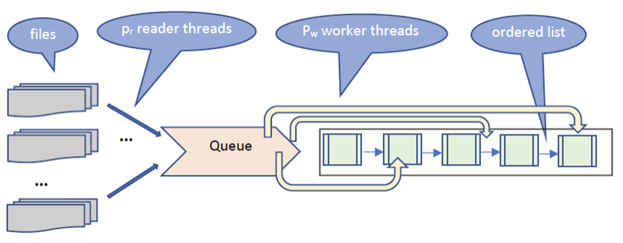

# Homework 4 - Producer Consumer Pattern without Conditional Variabiles

At a programming competition, participants from different countries compete. The competition involves solving multiple (10) problems within a given time frame. Each participant is identified by an ID, and the results obtained for solving each problem are saved in a results file where each line consists of entries in the form (ID, Score). The scores of participants from a country C1 corresponding to each problem are found in separate files ("ResultsC1_P1.txt," "ResultsC1_P2.txt," ... "ResultsC1_P10.txt"). A negative score (-1) indicates an attempt at fraud and will lead to the elimination of the participant from the competition. If a participant does not solve a problem, a pair with the participant's ID and a score of 0 is not added to the file.

To reach the final ranking, it is requested to create a linked list ordered in descending order (by score) that contains elements with pair values (ID, Score). The list is an ordered list (invariant: after any operation, the list is ordered).

We start by creating an empty linked list and add elements or scores as records are read from the files. When reading a new pair (ID_n, Score_n), it is checked whether there is already a pair in the list with an ID equal to ID_n:

If it exists:
If Score_n is positive, add Score_n to the existing score in the node.
If Score_n = -1, then remove the found node from the list.
If a pair with the same ID is read later, it will not be added to the list.
If it does not exist, add a new node with the value (ID_n, Score_n).

## Approach

For the first iteration, we weren't allowed to use conditional variables, but we could simulate that using semaphores. To achieve this, I implemented two linked lists:

- the queue where the file readers will write the given data and the workers threads will read it. For this, we needed to use the semaphore to make the worker threads wait while the queue is empty (to not make them busy-wait), and the readers will notify the workers when new data is added in the queue. For the readers, we just needed to block the queue and add the given data, signaling the threads when necessary
- the ordered list where the top is being done. Each worker thread will fully block the queue in order to modify it. Each thread will first try to remove the given participant, if it doesn't exist in the queue it would simply insert, but if it exists and it has a score of -1, it will insert again, without affecting its score (because its disqualified), it will be inserted with the score -1 if the read score its also -1, or it will increase the current score with the read score otherwise.

## Results

| Type       | Read Threads | Worker Threads |    Time |
| :--------- | :----------- | :------------- | ------: |
| Sequential | -            | -              | 8.86945 |
| Threads    | 1            | 4              | 19.3238 |
| Threads    | 1            | 6              | 20.8132 |
| Threads    | 1            | 8              | 21.2926 |
| Threads    | 1            | 16             | 21.8031 |
| Threads    | 2            | 4              | 19.3191 |
| Threads    | 2            | 6              | 20.0796 |
| Threads    | 2            | 8              | 21.9855 |
| Threads    | 2            | 16             | 23.5829 |

## Observations

We can see that all the parallel times are twice as slow as the sequential one, that's probably because there are a lot of mutexes being locked and unlocked which are a bit time consuming (because a lot of syncronization problems can happend).

The file read was done C style (with fopen, fscanf, etc.) because it performed a lot better than the C++ file read style (ifstream fin, fin >> val, etc.), so we can see that increasing the number of readers does a very small increase in performance for some cases, and that's probably because the first input data arrives faster at the threads. Experimenting, I observed that the readers are a lot faster than the workers, and that's probably because the workers depended on the same queue, and locking all of it reduced some performance.
