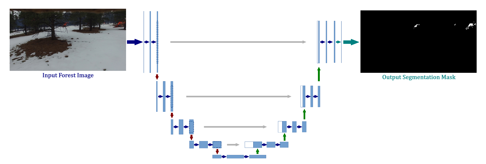
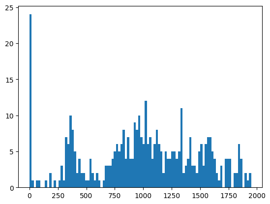
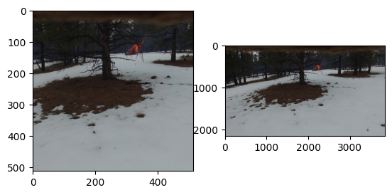
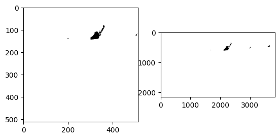

# Forest Fire Detection

Forest fires are natural disasters that pose a major threat to the environment, communities, and ecosystems. Early prediction and detection of forest fires are crucial for mitigating damage and minimizing the efforts required for extinguishing flames. This project uses deep learning techniques to detect forest fires from images.

More details can be found [here](https://github.com/razvan404/forest-fire-detection).

Figure 1. The architecture of the prediction model

Figure 2. Histogram of the amount of pixels labeled as <em>fire</em>

Figure 3. Dataset preprocessing (central crop + resize + normalization)

