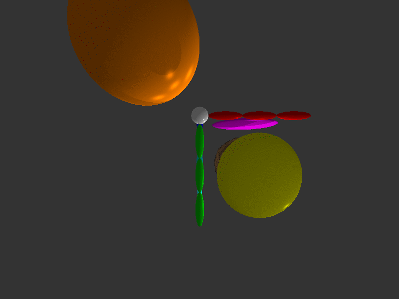
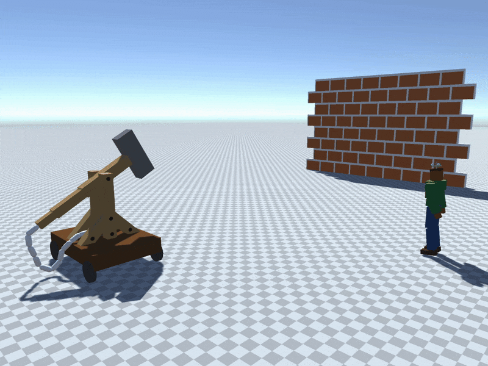
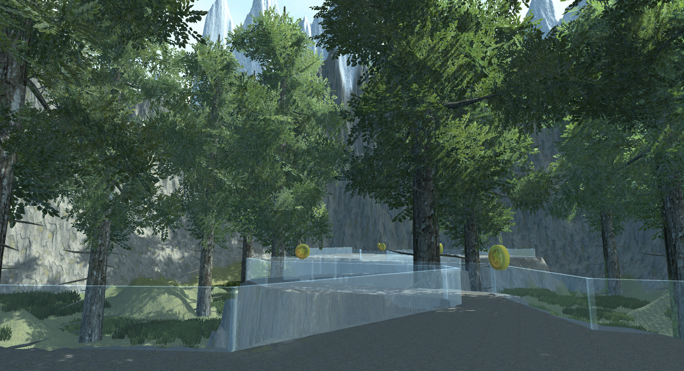
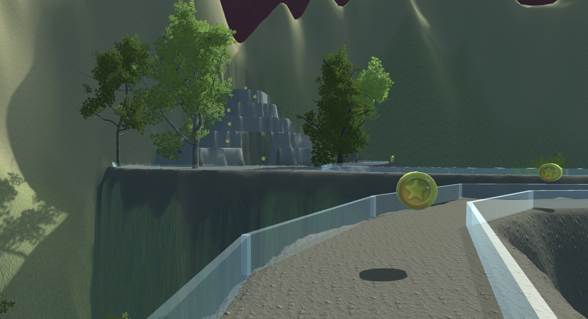

# Babes-Bolyai University Projects

## Table of contents

- 📕 Semester 1
  - 🧮 [Algebra](1st%20Semester/Algebra)
  - 📊 [Mathematical Analysis](1st%20Semester/Mathematical%20Analysis)
  - 🌒 [Computational Logic](1st%20Semester/Computational%20Logic)
  - 💾 [Computer Systems Architecture](1st%20Semester/Computer%20Systems%20Architecture)
  - 🍼 [Programming Fundamentals](1st%20Semester/Programming%20Fundamentals)
  - 📞 [C Programming](1st%20Semester/C%20Programming)
  - 🙊 [Professional Communication (in Computer Science)](1st%20Semester/Professional%20Communication)
- 📙 Semester 2
  - 🏝️ [Dynamical Systems](2nd%20Semester/Dynamical%20Systems)
  - 📐 [Geometry](2nd%20Semester/Geometry)
  - 🔗 [Data Structures and Algorithms](2nd%20Semester/Data%20Structures%20and%20Algorithms)
  - 🎯 [Graph Algorithms](2nd%20Semester/Graph%20Algorithms)
  - 🚜 [Object-Oriented Programming](2nd%20Semester/Object-Oriented%20Programming)
  - 🐚 [Operating Systems](2nd%20Semester/Operating%20Systems)
  - 🦦 [Advanced Methods for Solving Algorithmic Problems](2nd%20Semester/Advanced%20Methods%20for%20Solving%20Algorithmic%20Problems)
- 📒 Semester 3
  - 🎰 [Probability Theory and Statistics](3rd%20Semester/Probability%20Theory%20and%20Statistics)
  - 🧭 [Advanced Programming Methods](3rd%20Semester/Advanced%20Programming%20Methods)
  - 🗺️ [Computer Networks](3rd%20Semester/Computer%20Networks)
  - 🗂️ [Databases](3rd%20Semester/Databases)
  - 🪢 [Functional and Logic Programming](3rd%20Semester/Functional%20and%20Logic%20Programming)
- 📗 Semester 4
  - 🧬 [Artificial Intelligence](4th%20Semester/Artificial%20Intelligence)
  - 🗃️ [Database Management Systems](4th%20Semester/Database%20Management%20Systems)
  - 👷 [Software Engineering](4th%20Semester/Software%20Engineering)
  - 🎨 [Systems for Design and Implementation](4th%20Semester/Systems%20for%20Design%20and%20Implementation)
  - 🕸️ [Web Programming](4th%20Semester/Web%20Programming)
- 📘 Semester 5
  - ⚙️ [Formal Languages and Compiler Design](5th%20Semester/Formal%20Languages%20and%20Compiler%20Design)
  - ⚡ [Parallel and Distributed Programming](5th%20Semester/Parallel%20and%20Distributed%20Programming)
  - 📱 [Mobile Application Programming](5th%20Semester/Mobile%20Application%20Programming)
  - 👁️‍🗨️ [Computer Vision and Deep Learning](5th%20Semester/Computer%20Vision%20and%20Deep%20Learning)
  - 🛰️ [Virtual Reality](5th%20Semester/Virtual%20Reality)
  - 🐧 [Affective Computing](5th%20Semester/Affective%20Computing)
  - 📜 [Research Project](5th%20Semester/Research%20Project)
- 📓 Semester 6
  - 📈 [Numerical Calculus](6th%20Semester/Numerical%20Calculus)
  - 📝 [Software Systems Verification and Validation](6th%20Semester/Software%20Systems%20Verification%20and%20Validation)
  - 🌍 [Artificial Intelligence Models for Climate Change](6th%20Semester/Artificial%20Intelligence%20Models%20for%20Climate%20Change)
  - 👾 [Development Methods for Intelligent Systems](6th%20Semester/Development%20Methods%20for%20Intelligent%20Systems)
  - 💼 [Software Projects Management](6th%20Semester/Software%20Projects%20Management)
  - 🚓 [Academic Ethics and Integrity (in Computer Science)](6th%20Semester/Academic%20Ethics%20and%20Integrity)

## Highlights

### Virtual Reality Projects

In the [Virtual Reality](5th%20Semester/Virtual%20Reality) course, we completed three major projects:

- [**Ray Tracing Implementation**](5th%20Semester/Virtual%20Reality/Project1/): We began by developing a basic ray tracer in C# that rendered circles in a 3D space. We then enhanced this by adding lights and shadows, extended it to render ellipsoids, and finally, we rendered volumetric data, such as a transparent walnut with a visible seed.

- [**Physics Project in Unity**](5th%20Semester/Virtual%20Reality/Project2/): This project involved creating a satellite that orbited the scene, a catapult that launched a rock into a wall designed to shatter, and a robot that moved like a human and had an antenna that followed the satellite.

- [**Theme Project**](5th%20Semester/Virtual%20Reality/Project3/): The final project aimed to address phobias by placing users in a controlled virtual reality environment. By gradually increasing the intensity of the phobia, the goal was to help users overcome their fears.

